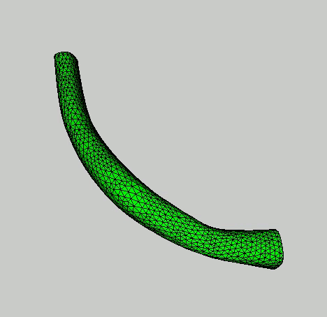

#### Programmatic Modeling of Blood Vessels
For use with SimVascular API, 2020-09-09 Release. https://simvascular.github.io/

This repository allows you to programmatically alter the cross sections of a blood vessel and prepare the files required for simulation.

#### Usage
1. Construct a segmentation through the SimVascular GUI.
1. From the project's Segmentations folder, copy the .ctgr file to the current repository.
1. Make edits at the top of the contour\_to\_mesh.py file to specify directory names and expansion of segmentation control points.
1. In SimVascular, open the Python console and press play. (Note: graphics halt execution of code. Code continues if graphics window is closed.)
